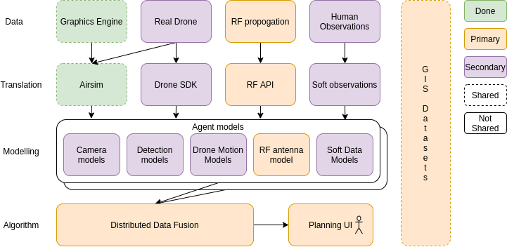
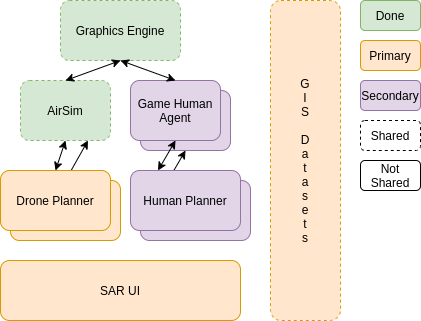

.. star=sar documentation master file, created by
   sphinx-quickstart on Mon Feb 10 12:18:56 2020.
   You can adapt this file completely to your liking, but it should at least
   contain the root `toctree` directive.

Welcome to star-sar's documentation!
====================================

.. toctree::
   :maxdepth: 2
   :caption: Contents:

Distributed Data Fusion Diagram
-------------------------------

Simulated SAR Diagram
---------------------

Documents for Reference
-----------------------
Simulation links
----------------
* `AirSim <https://microsoft.github.io/AirSim/>`_
* `UE4 <https://www.unrealengine.com/en-US/>`_

RF propogation
^^^^^^^^^^^^^^
* `ITU terrain model <https://en.wikipedia.org/wiki/ITU_terrain_model>`_
* `FRIS transmision <https://en.wikipedia.org/wiki/Friis_transmission_equation>`_

Distributed Data Fusion
^^^^^^^^^^^^^^^^^^^^^^^
* `Distributed Data Fusion <https://ieeexplore.ieee.org/document/7515322>`_

Indices and tables
==================

* :ref:`genindex`
* :ref:`modindex`
* :ref:`search`
